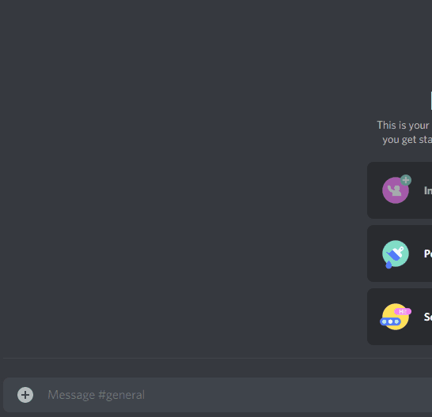

<h1 align="center">Wheel of names - Discord bot</h1>

<h3 align="center">A wheel of names bot build with <a href="https://github.com/discordjs/discord.js">discord.js</a></h3>

## Introduction

This bot generates a dynamic spin wheel gif with the options specified as arguments. It uses the `canvas` and `gifencoder` packages to create the spin wheel GIF.

## How to use

1. Install the packages with _npm install_.
2. Get your Discord bot token and configure it in your server. Configure the bot with `MESSAGE CONTENT INTENT` and `Send Message` permission.
3. To start the bot use: `TOKEN=yourtoken yarn start` or `TOKEN=yourtoken yarn dev` if you need hot reload.

## Available commands

- **!pick**: this command creates the spin wheel with the options passed as arguments separated by commas.

  Example: _!pick option1,option2,option3,option4_

## Limitations

The Discord API does not allow to modify the files embedded in a message, so it is necessary to delete and send another message. This produces a strange effect, but it works 😄
